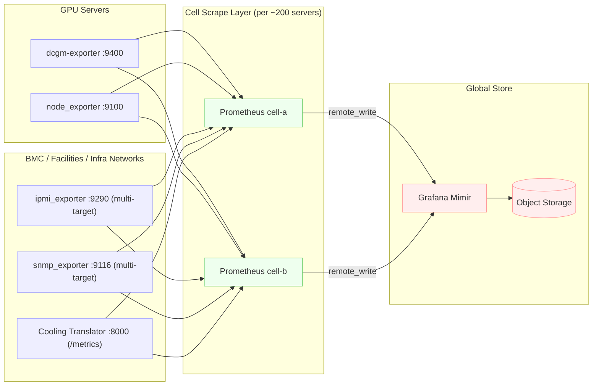

# xAI-Scale Datacenter Metrics Collection

[](https://github.com/arafath-am/xai-scale-metrics-collection/actions/workflows/ci.yml)
[](https://opensource.org/licenses/MIT)
[](https://www.python.org/downloads/)
[](https://www.docker.com/)
[](http://makeapullrequest.com)

Prometheus-based monitoring architecture for large-scale GPU datacenters (~200k GPUs).

Built to demonstrate collection patterns for multi-DC AI infrastructure covering:
- GPU telemetry (DCGM)
- Host OS metrics (node_exporter)
- Out-of-band management (IPMI/Redfish)
- Facility infrastructure (PDUs, UPS, switches via SNMP)
- Cooling plant systems (custom REST→Prometheus translator)

This focuses on the **collection tier and storage backend**, not visualization layers.

## Architecture Overview



## Repository Structure

- **`docs/`** — Design decisions on sharding, labeling, network isolation, failure modes
- **`configs/prometheus/`** — Reference scrape configs with cell-based sharding, multi-target exporters
- **`exporters/cooling_rest_exporter/`** — Example custom exporter (JSON/REST → Prometheus format)
- **`tools/targetgen.py`** — Generates Prometheus file_sd targets from datacenter inventory CSV
- **`inventory/`** — Sample CSV schema for asset tracking

## Quick Start

**Run the full demo stack locally:**

```bash
docker-compose up -d
```

This starts:
- **Mock DCGM Exporter** (http://localhost:9400/metrics) - Simulated 8x H100 GPUs
- **Cooling Exporter** (http://localhost:8000/metrics) - Production exporter
- **Prometheus** (http://localhost:9090) - Metrics collection
- **Grafana** (http://localhost:3000) - Dashboards (admin/admin)

See [TESTING.md](TESTING.md) for detailed testing guide.

**Or run just the cooling exporter:**

```bash
python3 -m venv venv
source venv/bin/activate
pip install -r exporters/cooling_rest_exporter/requirements.txt
python exporters/cooling_rest_exporter/app.py

# Scrape endpoint: http://127.0.0.1:8000/metrics
# Health check: http://127.0.0.1:8000/healthz
```

**Generate Prometheus targets from inventory:**

```bash
python tools/targetgen.py inventory/sample_inventory.csv configs/prometheus/targets/
```

## Design Highlights

### Cell-Based Sharding
Each Prometheus instance scrapes ~200 GPU servers. Horizontal scaling achieved by adding cells as fleet grows.

### Multi-Target Pattern
IPMI and SNMP exporters use relabeling to scrape many devices through a single exporter endpoint, reducing the number of long-running processes.

### Global Aggregation
Cell Prometheus instances remote_write to Grafana Mimir for centralized querying and long-term storage in object storage (S3/GCS/Azure Blob).

### Cardinality Management
Strict label controls (dc, row, rack, cell, host, gpu index). UUIDs, serial numbers, and PIDs explicitly excluded to prevent cardinality explosion.

## Production Deployment Notes

### Deployment Options

**Systemd (Bare Metal / VMs):**
```bash
# Install exporter
sudo mkdir -p /opt/cooling_exporter
sudo cp exporters/cooling_rest_exporter/{app.py,requirements.txt} /opt/cooling_exporter/
python3 -m venv /opt/cooling_exporter/venv
/opt/cooling_exporter/venv/bin/pip install -r /opt/cooling_exporter/requirements.txt

# Install and start service
sudo cp exporters/cooling_rest_exporter/cooling-exporter.service /etc/systemd/system/
sudo systemctl daemon-reload
sudo systemctl enable --now cooling-exporter
sudo systemctl status cooling-exporter
```

**Docker:**
```bash
cd exporters/cooling_rest_exporter
docker build -t cooling-exporter:latest .
docker run -d \
  -p 8000:8000 \
  -e COOLING_API_URL=http://your-cooling-gateway/api \
  --name cooling-exporter \
  cooling-exporter:latest
```

**Kubernetes:**
```bash
kubectl apply -f exporters/cooling_rest_exporter/k8s-deployment.yaml
kubectl -n monitoring get pods -l app=cooling-exporter
kubectl -n monitoring logs -f deployment/cooling-exporter
```

### Prometheus Configuration

Deploy cell-based Prometheus instances:

```bash
# Generate targets from your inventory
python tools/targetgen.py inventory/your-datacenter.csv configs/prometheus/targets/

# Deploy Prometheus with the cell config
docker run -d \
  -p 9090:9090 \
  -v $(pwd)/configs/prometheus:/etc/prometheus \
  prom/prometheus:latest \
  --config.file=/etc/prometheus/cell-prometheus.yml
```

Configure remote_write to Mimir:
```yaml
remote_write:
  - url: https://mimir.your-domain.internal/api/v1/push
    basic_auth:
      username: prometheus-cell-01
      password_file: /etc/prometheus/mimir-password
```

### Testing & Validation

**Health Checks:**
```bash
# Exporter health
curl http://localhost:8000/healthz
# Expected: {"healthy": true, "staleness_seconds": <15, ...}

# Metrics endpoint
curl http://localhost:8000/metrics | grep cooling_
# Should see: cooling_supply_air_temp_celsius, cooling_fan_speed_rpm, etc.
```

**Prometheus Scraping:**
```bash
# Verify targets are up
curl http://localhost:9090/api/v1/targets | jq '.data.activeTargets[] | select(.health != "up")'
# Empty output = all targets healthy

# Query recent metrics
curl 'http://localhost:9090/api/v1/query?query=up{job="dcgm"}' | jq .
```

**Integration Test:**
```bash
# Run unit tests
cd exporters/cooling_rest_exporter
pytest test_app.py -v --cov=app

# Validate Prometheus configs
docker run --rm -v $(pwd)/configs/prometheus:/config \
  prom/prometheus:latest \
  promtool check config /config/cell-prometheus.yml
```

### Monitoring the Monitors

Watch for exporter issues:
```promql
# Alert if cooling exporter hasn't fetched data in 2 minutes
(time() - cooling_fetch_total) > 120

# Alert if any DCGM exporter is down
up{job="dcgm"} == 0

# Alert if BMC scrape failures spike
rate(ipmi_scrape_errors_total[5m]) > 0.1
```

### Operational Notes

- **Network isolation:** Deploy IPMI/SNMP exporters on OOB network, not compute network
- **Retention tuning:** Start with 7d local, adjust based on query latency and disk usage
- **Cardinality check:** `curl localhost:9090/api/v1/status/tsdb | jq .data.seriesCountByMetricName` - watch for runaway series
- **GPU thermal alerts:** Set thresholds at 80°C warning, 85°C critical (depends on your GPUs)
- **Cooling staleness:** Alert if cooling metrics are >5 minutes old (facility issue)

### Troubleshooting

**Exporter not scraping:**
```bash
# Check logs
journalctl -u cooling-exporter -f
# or
docker logs -f cooling-exporter

# Common issues:
# - COOLING_API_URL unreachable → test with curl
# - JSON parse error → validate payload format
# - Permission denied → check file ownership/SELinux
```

**High cardinality:**
```bash
# Find top cardinality metrics
curl localhost:9090/api/v1/status/tsdb | jq -r '.data.seriesCountByMetricName[] | "\(.name): \(.value)"' | sort -t: -k2 -nr | head

# If DCGM series exploded, check for:
# - UUID labels (should be dropped)
# - Pod/container labels on DaemonSet metrics (relabel them out)
```

**Mimir remote_write failing:**
```bash
# Check Prometheus logs
docker logs prometheus-cell-01 | grep remote_write

# Common causes:
# - Auth failure → verify credentials
# - Rate limiting → add more Mimir ingesters
# - Network timeout → increase remote_write timeout
```

## License

MIT — see `LICENSE` file.

## Contributing

Contributions are welcome! Please read [CONTRIBUTING.md](CONTRIBUTING.md) for guidelines on:
- Setting up the development environment
- Running tests
- Submitting pull requests
- Code style requirements

## Star History

If you find this project useful for learning about GPU datacenter monitoring or as a reference architecture, please consider giving it a ⭐!

## Changelog

See [CHANGELOG.md](CHANGELOG.md) for release history and notable changes.
